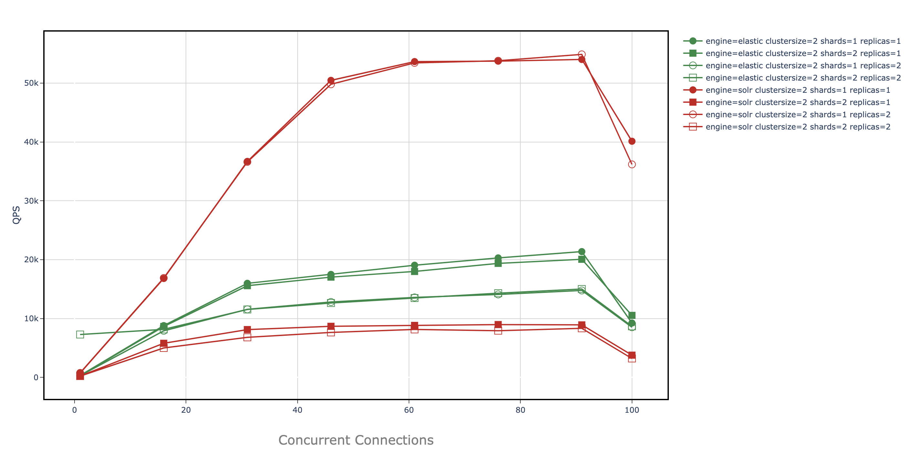

## Solrcloud vs Elastic performance evaluation with JANUS cloud-native benchmarking framework

### OVERVIEW

Sapa is a project to evaluate the performance of two cloud-native search engines, solrcloud and elastic. To help manage and orchestrate the benchmark experiment, Sapa used the cloud-native benchmarking framework, JANUS. The purpose of sapa is to quickly discover optimal deployment strategies given organizational constraints. Search engine config state space is incredibly large (fig1). Consequentially, tuning these apps for performance requires a lot of guesswork since there is no silver bullet when it comes to the best configuration. SAPA takes the guesswork out of performance tuning by providing a tight feedback loop on the performance of your deployment strategies.  
 
 fig 1 | notes 
 ---- | ----
  | The single line traversing this state space represents a single deployment. This graph illustrates a simple example of a deployment state space definition; each color represents a config category, and each dot represents a configured value. Many production systems will choose to compare many more verticals.  
 


__need to tell a story here, basically a placeholder for now__

 fig 2: CDF 91 connections | fig 3: Total Throughput
 ---- | ----
  |  


### INSTALLATION

Requirements:
To deploy you need to set up a local and remote env

##### LOCAL:  
Create a python3 virtual env:  
`pyenv activate your_env`

install packages:  
`pip install ansible paramiko Jinja2 numpy`


##### REMOTE:  
_janus provides benchmarking even if you don't have cloud resources but emulating them with Docker locally. So, if you choose this route, please_:
- add 0.0.0.0 as hostname for config file in ~/.ssh/config for all servers used in docker-compose.yml (see examples/config-host.example)
- make sure docker desktop configuration allocates enough CPU cores and RAM (50% of your machine is good)
- run docker-compose --compatibility up -d
- run `$ bash container_rsa.yml` to load ssh keys into your containers. 

###### for standard cloud deployment:
step1: 
place the domain names in clouddnsfile and run `getips.py <username> <clouddnsfile> <path_to_private_rsa_key> <#load nodes>` 
clouddns file example:
```
ms1.utah.cloudlab.us
ms9.utah.cloudlab.us
ms5.utah.cloudlab.us
ms4.utah.cloudlab.us
ms3.utah.cloudlab.us
...
```

this will generate >> `inventory_gen.txt` file. swap this file with `./inventory`


#### -> if you are installing from github source:
*these steps fork the solr repo, check out a specific branch, and duplicate that branch to your own dev branch.*
- fork the lucene-solr repo https://github.com/DavidCPorter/lucene-solr.git
- add ssh keys from solr nodes to github account (temp solution so ansible can easily update repos remotely)
- locally clone repo
- checkout branch_8_3 (or whatever solr version you want)
- create new branch <name> e.g. `git checkout -b <name>`
- push <name> branch to origin
- replace git_branch_name=dporter_8_3 in inventory to git_branch_name=<name>
- replace `dporte7` in ansible role "vars" and "defaults" files with your username in cloudlab

#### -> else: 
- you will simply specify version in yaml. 

##### LOAD env helpers utils.sh and be sure to replace JANUS_HOME and CL_USER var with your path for this app.

#### set up shell envs
1. run `ansible-playbook cloud_configure.yml` .. this will also generate utils.sh locally @ /benchmarkscripts/utils/utils.sh

