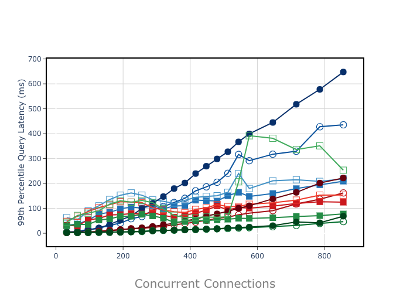

## Evaluation of 12 SolrCloud deployments with JANUS cloud-native benchmarking framework

## OVERVIEW

SAPA is a project to evaluate the performance of 24 cloud-native search engine deployments using solrcloud. To help manage and orchestrate the benchmark experiment, SAPA used the cloud-native benchmarking framework, JANUS. The purpose of SAPA is to quickly discover optimal deployment strategies given organizational constraints. 


#### MOTIVATION
The state space for search engines is incredibly large (fig1). The immense configuration options and ancillary support systems creates this overwhelming state space. Consequentially, tuning these search engine systems for optimal performance requires a lot of guesswork since there is no silver bullet when it comes to the best configuration and **deployment techniques**. SAPA takes the guesswork out of performance tuning by providing a tight feedback loop on the performance of your deployment strategies.  
***deployment techniques** cover strategies external to search engine config files. e.g. load balancers, external caching, network functions etc.*
 
 fig 1 | notes 
 ---- | ----
  | The single line traversing this state space represents a single deployment. This graph illustrates a simple example of a deployment state space definition; each color vertical represents a config or technique category, and each dot represents a configured value. Many production systems will choose to evaluate many more search engine verticals.
 
### INSTALLATION
see JANUS installation instructions 
https://github.com/DavidCPorter/janus-framework
*these instructions explain how to set up a local cloud env. If you have access to CLOUDLAB, you may use a quick and very dirty script to create the inventory file for SAPA.* see appendix


these janusfiles set the required variables, the rest of the variables resolve to default values
this assumes ubuntu servers provisioned. 

SAPAs intention is to demonstrate the performance of 12 configurations varying in shard replica and clustersize for two different experiments: a cloud-aware load balancer and a round-robin load balancer


to set up the round robin experiment, run:
```
$ janus new --name roundrobin --branches c2s2r2,c2s1r2,c4s2r2,c4s1r2,c8s2r2,c8s1r2,c2s2r1,c2s1r1,c4s2r1,c4s1r1,c8s2r1,c8s1r1
$ janus roundrobin
  > load janusfile
  > start
```

to set up the cloud-aware experiment, run:
```
$ janus new --name cloud-aware --branches c2s2r2,c2s1r2,c4s2r2,c4s1r2,c8s2r2,c8s1r2,c2s2r1,c2s1r1,c4s2r1,c4s1r1,c8s2r1,c8s1r1`
$ janus cloud-aware
  > load janusfile
  > start
```
### LOADED JANUSFILES
*A janusfile runs predefined management plane tasks for JANUS experiments. Below are the two janusfiles used for these experiments.*

#### roundrobin JANUSFILE
```
add modules cloud-env zookeeper solr solrj-loadbalancer amazon-reviews-large index_solr http_closed_loop solr_pipe cdf horizontal_scale throughput all
order modules cloud-env zookeeper solr solrj-loadbalancer amazon-reviews-large index_solr http_closed_loop solr_pipe cdf horizontal_scale throughput all

add hosts threeNode zookeeper all
add vars zoo_version 3.5.5 all

add vars solr_version dporter_8_3 solr_heap 1 solr_repo https://github.com/DavidCPorter/lucene-solr.git all
add vars endpoint_host 10.10.1. endpoint_port 8983 all
add vars replicas 2 c2s2r2,c2s1r2,c4s2r2,c4s1r2,c8s2r2,c8s1r2
add vars replicas 1 c2s2r1,c2s1r1,c4s2r1,c4s1r1,c8s2r1,c8s1r1
add vars shards 1 c2s1r2,c2s1r1,c4s1r2,c4s1r1,c8s1r2,c8s1r1
add vars shards 2 1 c2s2r1,c2s2r2,c4s2r1,c4s2r2,c8s2r1,c8s2r2

add vars load_duration 10 loop_type closed engine solr all
add vars min_conn 10 max_conn 800 increment 20 procs 16 threads 1 query solrj all

add hosts twoNode solr c2s2r1,c2s1r1,c2s1r2,c2s2r2
add hosts fourNode solr c4s2r1,c4s1r1,c4s1r2,c4s2r2
add hosts eightNode solr c8s2r1,c8s1r1,c8s1r2,c8s2r2
add hosts generatorNode http_closed_loop all
add hosts localhost solr_pipe all
add hosts generatorNode solr_pipe 2_read_results.yml all
add hosts localhost cdf all
add hosts singleNode index_solr all
add hosts singleNode amazon-reviews-large all
add hosts twoNode index_solr 0_pre_index_config.yml c2s2r1,c2s1r1,c2s1r2,c2s2r2
add hosts fourNode index_solr 0_pre_index_config.yml c4s2r1,c4s1r1,c4s1r2,c4s2r2
add hosts eightNode index_solr 0_pre_index_config.yml c8s2r1,c8s1r1,c8s1r2,c8s2r2
```

#### cloud-aware load balancer JANUSFILE
same as above with changes to the respective lines below:
```
add modules cloud-env zookeeper solr amazon-reviews-large index_solr http_closed_loop solr_pipe cdf horizontal_scale throughput all
order modules cloud-env zookeeper solr amazon-reviews-large index_solr http_closed_loop solr_pipe cdf horizontal_scale throughput all
add vars min_conn 10 max_conn 800 increment 20 procs 16 threads 1 query roundrobin all
```


### RESULTS for each experiment:
 SAPA EXPERIMENTS OVERVIEW | LEGEND
 ---- | ----
The two experiments evaluate the query performance of 12 different search engine configurations for both roundrobin loadbalancing and zookeeper-enabled cloud-aware loadbalancing. The 12 different configurations are denoted by their respective symbol in the legend | 

#### ROUND ROBIN LOAD BALANCER RESULTS:
###### cdf(concurrent_connections)

###### throughput P50

###### throughput P95

###### throughput P99

###### max throughput

###### horizontal scale


#### CLOUD-AWARE LOAD BALANCER RESULTS:
###### cdf(concurrent_connections)

###### throughput P50

###### throughput P95

###### throughput P99

###### max throughput

###### horizontal scale


#### APPENDIX

#### CLOUDLAB inventory configuration
step1: 
place the domain names in clouddnsfile and run `utils/getips.py <username> <clouddnsfile> <path_to_private_rsa_key> <#load nodes>` 
clouddns file example:
```
ms1.utah.cloudlab.us
ms9.utah.cloudlab.us
ms5.utah.cloudlab.us
ms4.utah.cloudlab.us
ms3.utah.cloudlab.us
...
```

this will generate >> `inventory_gen.txt` file. swap this file with `./inventory`
